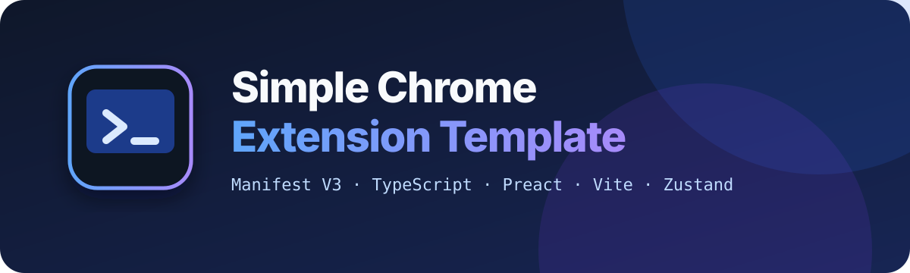

<p align="center">
  
</p>

<p align="center">
  A practical Manifest V3 starting point with TypeScript, Preact, Vite, typed messaging, and a shared theme system.
</p>

<p align="center">
  <a href="https://github.com/Avinava/simple-chrome-extension-template/actions/workflows/ci.yml"></a>
  <a href="LICENSE"></a>
  
</p>

## Why this template

Start with the pieces a real extension needs, not an empty popup: a background
service worker, typed cross-context messages, persistent settings, theme sync,
and distinct popup, options, side-panel, and content-script examples. The
example features are disposable; the architecture is the part to keep.

## Included

- **Manifest V3 + CRX/Vite** — the manifest defines extension entry points and Vite builds them.
- **TypeScript + Preact + HTM** — small UI surfaces with strict type checking and no JSX transform configuration.
- **Core services** — typed message bus, storage abstraction, and defensive Chrome API helpers.
- **Vanilla Zustand stores** — presentation components stay free of browser API calls.
- **Shared design system** — light, dark, and system themes synchronized across open extension surfaces.
- **Production hygiene** — tests, linting, formatting, CI, Dependabot, and contributor guidance included.

## Quick start

```bash
git clone https://github.com/Avinava/simple-chrome-extension-template.git my-extension
cd my-extension
npm install
npm run dev
```

Use Node.js 22.18 or newer. To load the production build:

```bash
npm run build
```

Open `chrome://extensions`, enable **Developer mode**, choose **Load unpacked**,
and select `dist/`.

## Architecture at a glance

```text
popup / options / side panel     content script
             │                       │
             └──── stores + MessageBus ────┐
                                            │
                                 background service worker
                                            │
                           core services and typed contracts
```

`src/core` is generic infrastructure. The background worker coordinates
privileged work and cross-context communication. Each UI surface owns a vanilla
Zustand store; components render state and invoke store actions. See
[ARCHITECTURE.md](ARCHITECTURE.md) for the full dependency rules.

## Project map

```text
src/
  background/   service-worker bootstrap, command and message handlers
  content/      injected-page example
  core/         Chrome wrappers, storage, messages, utilities, shared types
  options/      options surface and store
  popup/        toolbar surface and store
  shared/       theme store, toggle, and design tokens
  sidepanel/    side-panel surface and store
  utils/        Preact and icon glue
```

## Working with the template

### Add a feature

1. Put browser behavior in a surface store and use a `src/core/services` helper.
2. For cross-context work, add a message to `src/core/types/messages.ts` and a
   case to the background router.
3. Keep components presentational: they must not call `chrome.*` directly.
4. Use design tokens and shared primitives rather than raw visual values.

The repository rules for contributors and AI tools live in [AGENTS.md](AGENTS.md).

### Design and theming

`src/shared/theme.css` is the design system. It provides semantic colors,
spacing, typography, radius, shadow, focus, motion, and z-index tokens. Theme
selection persists in sync storage and updates every open extension surface.
Read the [design-system guide](docs/design-system.md) before extending it.

### Permissions

The starter's content-script demo runs on web pages so it can show the floating
button and respond to context-menu actions. Before publishing a product,
restrict the manifest's host matches to the domains you need or remove that
demo. Do not ship `<all_urls>` by default.

## Commands

| Command | Purpose |
| --- | --- |
| `npm run dev` | Start Vite development mode |
| `npm run build` | Build the unpacked extension into `dist/` |
| `npm run build:watch` | Rebuild on changes |
| `npm run preview` | Preview the production build |
| `npm run typecheck` | Check TypeScript without emitting files |
| `npm test` | Run the Vitest suite once |
| `npm run test:watch` | Run tests in watch mode |
| `npm run lint` | Lint source and configuration |
| `npm run format:check` | Check source formatting |
| `npm run format:all` | Format repository files |
| `npm run zip` | Build `extension.zip` |

Before opening a pull request, run:

```bash
npm run typecheck && npm test && npm run format:check && npm run lint && npm run build
```

## Documentation

- [Architecture](ARCHITECTURE.md)
- [Design system](docs/design-system.md)
- [Extension development](docs/extension-development.md)
- [Contribution guide](CONTRIBUTING.md)
- [Security policy](SECURITY.md)
- [Changelog](CHANGELOG.md)

## License

[MIT](LICENSE)
