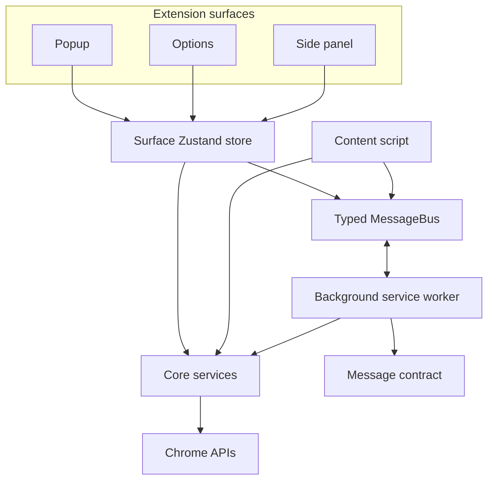

# Architecture

The template separates reusable extension infrastructure from feature-specific
surfaces. It is deliberately small: the intended extension point is adding a
feature cleanly, not adopting a framework inside a framework.

## Dependency map

`src/core` only depends on Chrome APIs and TypeScript. UI surfaces and the
content script may depend on `core`, `shared`, and `utils`. Nothing outside a
surface depends on that surface.

## Repository map

| Area | Responsibility |
| --- | --- |
| `src/core/` | Generic Chrome wrappers, storage, messaging, shared types, and pure utilities |
| `src/background/` | Service-worker startup, lifecycle work, command handlers, and message routing |
| `src/popup/`, `src/options/`, `src/sidepanel/` | Independent Preact surfaces and their Zustand stores |
| `src/content/` | Web-page integration example |
| `src/shared/` | Design tokens, theme state, and reusable UI such as the theme toggle |
| `src/utils/` | Preact/HTM, Zustand, and icon adapters |

## Core services

Import services through `@core/services`.

- `MessageBus` wraps extension messaging in typed promise-based calls that
  return `CommonResponse` values instead of throwing expected runtime errors.
- `StorageService` provides typed access to `chrome.storage` areas with safe
  fallback behavior for tests and unavailable APIs.
- `ChromeApiWrapper` groups focused helpers: tabs, history, bookmarks, script
  injection, runtime URLs, side-panel opening, and notifications.

Add a helper when it can be reused across contexts. Keep business decisions in
the caller or a feature-specific store.

## Messaging

Messages are discriminated by `action` in `src/core/types/messages.ts`.

1. A store or content script calls `MessageBus.send()` or `sendToTab()`.
2. `createMessageRouter()` in the background worker dispatches the action.
3. The handler returns one `CommonResponse`; asynchronous handlers keep the
   response channel open.

To add an action, define its interface, include it in `ExtensionMessage`, and
add a router case. Test the new handler next to `MessageHandlers.ts`.

## State and UI

Each Preact surface has a vanilla Zustand store. Stores own async behavior,
persistence, and Chrome API calls; components select state with `useStore()`
and render it. The popup, options page, and side panel demonstrate the pattern.

HTM templates are rendered through `@utils/preact-htm`; Lucide icons are
rendered through `@utils/icons`. Prefer shared primitives and tokens over a new
UI dependency.

## Theme system

`src/shared/theme.css` supplies semantic color, type, spacing, radius, shadow,
motion, and layer tokens. `themeStore` persists `light`, `dark`, or `system` in
sync storage, applies the selected root class, and asks the background worker
to relay changes to other open surfaces.

See [docs/design-system.md](docs/design-system.md) for token and extension
guidance.

## Adding a surface

1. Add the HTML entry and Preact entry under `src/`.
2. Add its manifest entry; CRX discovers the build input there.
3. Create a local Zustand store for its behavior.
4. Import the shared theme and initialize it at the entry point.
5. Add tests and run the full verification checklist in [AGENTS.md](AGENTS.md).
